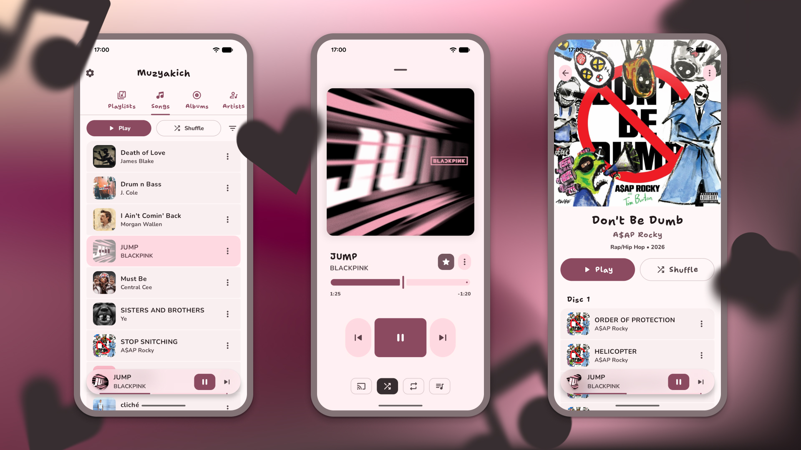

# Muzyakich

Muzyakich is a modern, native Android application for managing custom playlists and exploring your
personal music library, built with a focus on a reactive and seamless user experience.

## Features

- **Music Library:** Browse your collection by songs, albums, and artists in a unified library.
- **Advanced Player:** Manage your playback with a feature-rich player, including queue reordering and quick access to favorites.
- **Playlists:** Create and personalize your own music collections with custom titles and cover images.
- **Favorites:** Easily mark and access your most-loved tracks.
- **Local & Private:** Your music stays on your device—uses MediaStore for a seamless local library experience.

## UI

The application strictly adheres to the [Material 3 Expressive][m3] design principles, offering
a refined, modern, and accessible interface built entirely with [Jetpack Compose][compose].

## Localization

We invite you to contribute to our localization efforts
on [Crowdin](https://crowdin.com/project/muzyakich) to help make this application accessible to
everyone in their native language.

## Support

If you find this tool valuable, consider supporting its continued development:

| Asset              | Address                                            |
|:-------------------|:---------------------------------------------------|
| **Bitcoin (BTC)**  | `bc1qn2dd85ek6dm8mm3wu3ws6cq507zgrtlgatl20z`       |
| **Ethereum (ETH)** | `0x78cD353134CbffeD8B941fF05a3Ac8B0bBd308e6`       |
| **USDT (TRC20)**   | `TNs7AvHQ2TjFDKMA7nJ1US31A57tRUMvqN`               |
| **USDT (TON)**     | `UQBmZpwXjNhy44RiCUGIp8RYbFQZNrHYzslQ5G14G5DP2Mcu` |
| **Solana (SOL)**   | `G1zAFSJpbHcjwSvMjQuKZj99abZDmP4pSRdkKRaAWFFk`     |
| **Litecoin (LTC)** | `ltc1q8qrcnc6y3ajg7xslaxy6n90d8hk3252amzq8aw`      |

## License

Open-source software licensed under the **Apache License 2.0**. See the [LICENSE](LICENSE) file for
full details.

[m3]: https://m3.material.io/

[compose]: https://developer.android.com/jetpack/compose
